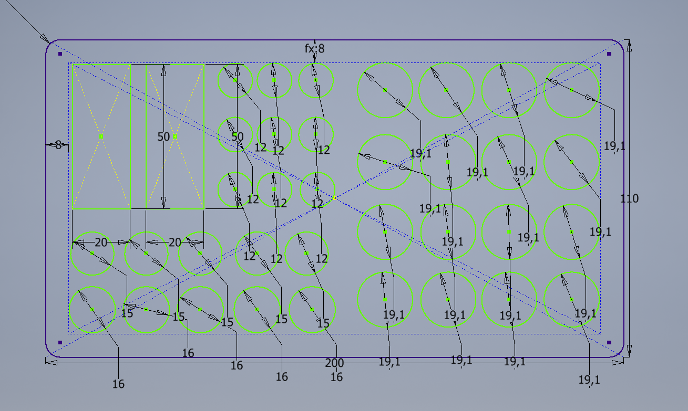

# BLButtons
A simple, BLE Buttons controller to implement Simulator's button panels.

# Table Of Contents

1. [Project Features](#project-features)

# Project Features

I have no features for now


## Bluetooth 3.0 doesn't support BLE, so ... moving to 4.0

## ExceptionDecoder & SPIFFS Image Downloader

1. Go to [https://github.com/me-no-dev/EspExceptionDecoder/releases/](https://github.com/me-no-dev/EspExceptionDecoder/releases/) and download the latest release.
1. Go to [https://github.com/me-no-dev/arduino-esp32fs-plugin/releases/](https://github.com/me-no-dev/arduino-esp32fs-plugin/releases/) and download the latest release.
2. Go to the Arduino IDE directory, and open the `Tools` folder.
3. Unzip the downloaded .zip folders to the Tools folder. 
4. You should get something like `/Arduino-<version>/tools/ESP32FS/tool/esp32fs.jar` and the same for the exception decoder.

* [https://amstudioprojects.com/product/32-function-button-box-guide/](https://amstudioprojects.com/product/32-function-button-box-guide/)
* [https://www.instructables.com/id/Sim-Racing-Button-Box/](https://www.instructables.com/id/Sim-Racing-Button-Box/)
To use SPIFFS:

1. Inside the sketch folder, create a new folder called `data`
2. Inside the data folder is where you should put the files you want to be saved into the ESP32 filesystem.
3. Then, to upload the files, in the `Arduino IDE` you just need to go to `Tools > ESP32 Sketch Data Upload`.

Note: in some ESP32 development boards you need to keep the ESP32 on-board **`BOOT`** button pressed while it’s uploading the files. When you see the `Connecting …….____……` message, you need to press the ESP32 on-board **`BOOT`** button.

## BL gamepad library

0. Bounce2[https://github.com/thomasfredericks/Bounce2](https://github.com/thomasfredericks/Bounce2)
1. Go to [https://github.com/lemmingDev/ESP32-BLE-Gamepad/releases](https://github.com/lemmingDev/ESP32-BLE-Gamepad/releases) and download the latest release.
2. In the Arduino IDE go to `"Sketch" -> "Include Library" -> "Add .ZIP Library..."` and select the file you just downloaded.
3. You can now go to `"File" -> "Examples" -> "ESP32 BLE Gamepad"` and select the example to get started.
4. Updated to [https://github.com/MagnusThome/ESP32-BLE-Gamepad](https://github.com/MagnusThome/ESP32-BLE-Gamepad)
5. On laptop works properly.
6. A keypad Lib [https://github.com/Chris--A/Keypad](https://github.com/Chris--A/Keypad) for [The Example](https://github.com/MagnusThome/ESP32-BLE-Gamepad/blob/master/examples/5rotaryencoders_32buttons/5rotaryencoders_32buttons.ino)
7. Info about HID profile [https://eleccelerator.com/tutorial-about-usb-hid-report-descriptors/](https://eleccelerator.com/tutorial-about-usb-hid-report-descriptors/)
8. Official Nordic HID BLE [https://cdn.sparkfun.com/datasheets/Wireless/Bluetooth/RN-HID-User-Guide-v1.0r.pdf](https://cdn.sparkfun.com/datasheets/Wireless/Bluetooth/RN-HID-User-Guide-v1.0r.pdf)
9. Two profiles [https://www.esp32.com/viewtopic.php?t=10400](https://www.esp32.com/viewtopic.php?t=10400)
10. Keyboard HID profile [https://github.com/rupin/ESPJoystick/blob/master/gamepadble632/gamepadble632.ino](https://github.com/rupin/ESPJoystick/blob/master/gamepadble632/gamepadble632.ino)
11. USB HID definition tables [https://www.usb.org/hid](https://www.usb.org/hid)
12. USB HID usage tables [http://www.freebsddiary.org/APC/usb_hid_usages.php](http://www.freebsddiary.org/APC/usb_hid_usages.php)
## Available PINOUTS


| GPIO   | ADC  | INPUT     | OUTPUT | NOTES                             |
|--------|------|-----------|--------|----------------------------------:|
|0       | 1/2  | pulled up | OK     | Outputs PWM signal at boot        |
|2       | 2/2  | OK        | OK     | Connected to LED. LOW->LED Light  |
|4       | 0/2  | OK        | OK     |                                   |
|12      | 5/2  | OK        | OK     | Boot fail if pulled HIGH          |
|13      | 4/2  | OK        | OK     | Boot fail if pulled HIGH          |
|14      | 6/2  | OK        | OK     | Outputs PWM signal at boot        |
|15      | 2/2  | OK        | OK     | Outputs PWM signal at boot        |
|16      |      | OK        | OK     | used on ESP-32_WROVER_KIT         |
|17      |      | OK        | OK     | used on ESP-32_WROVER_KIT         |
|18      |      | OK        | OK     |                                   |
|19      |      | OK        | OK     |                                   |
|21      |      | OK        | OK     |                                   |
|22      |      | OK        | OK     |                                   |
|23      |      | OK        | OK     |                                   |
|25      | 8/2  | OK        | OK     |                                   |
|26      | 9/2  | OK        | OK     |                                   |
|27      | 7/2  | OK        | OK     |                                   |
|32      | 4/1  | OK        | OK     |                                   |
|33      | 5/1  | OK        | OK     |                                   |
|34      | 6/1  | OK        |        | Input Only                        |
|35      | 7/1  | OK        |        | Input Only                        |

* ADC Column: ADC Channel/ADC1|ADC2. No number means no ADC.
* ADC2 pins cannot be used when Wi-Fi is used. 
* The ADC input channels have a 12 bit resolution. 
* This means that you can get analog readings ranging from 0 to 4095, in which 0 corresponds to 0V and 4095 to 3.3V. 
* ANALOG INPUTS: 14 . 10 on ADC2, 4 on ADC1 (usable with WIFI)
* DIGITAL INPUTS: 21 TOTAL, 7 only DIGITAL. Be careful with 12 and 13

* ANALOG -> 3 [18]
* KEYPAD -> 7x7 [14] [49 buttons] 
* Clutch -> 1 dedicated line (to avoid ghosting on the matrix - no use diodes)

## First Prototype

</img>

| ITEM  |   QUANTITY    | PINS  | TOTAL PINS |
|-------|---------------|-------|-----------:|
|LEVC   | 2             | 1     |          2 |
|LEV    | 9             | 2     |         18 |
|BUT    | 16            | 1     |         16 |
|ENC    | 5             | 3     |         15 | 
|POT    | 5             | 1     |          5 |
|-------|---------------|-------|-----------:|
| TOTAL |               |       |  56 (51+5) |       
|-------|---------------|-------|-----------:|

MAX: 21 INPUTS

Clutch LEFT (+1 Digital) 57 (52+5)
ENC->Really are:
2 for DT*CLK signal
1 for SWITCH (serial plug)

-> More push buttons
-> Less Lever
-> Less Rotary (eats 3 pins per rotary)
*****Confirm these values****
Better more push buttons? (24)

4 pot (axis)    (21-4=17) [better 4 and leave the wifi alone]
4x4 = 16 buttons (17-(4+4)=9)
2LEVC (9-2=7)
CLUTCH (7-2=5)
2LEV (5-4=1)
1 free XD

MAX 32 inputs !!!
16 + 2 + 2 + 2 = 22 + 4 axis

CLUTCH mode:
    16 buttons x 2 = 32 inputs
    configure the BLE to support up to 64 or more buttons ?


BOX: 200x110x65
Lever: 74 x 54 x 12 mm
Lever_Cover: 60 x 130 x 40 mm

ENC:    15
POT:    16x25
BUT:    19
LEVC:   20x50
LEV:    12


## IL2 Minimum Controls

### Joystick 

Engine Start
Water Radiators 
Oil Radiators
Wheel Brake
Inlet/Outlet Cowls
Mixture
RPM lever (Prop pitch)
Flaps
Landing Gear
Open/Close Canopy
Open/Close Bomb Bay Doors
Airbrakes
Mission Brief Screen
Engine Boost
Fire Guns/Cannons/Missiles/Bombs
Auto Level
Field of view zoom in
Field of view zoom out
Recenter Track IR
Eject


### Keyboard

Nav Lights
Instrument Lights
Super Charger Stage Toggle
Engine Select

### The BLE profile

```
 0x05, 0x01,              // USAGE_PAGE (Generic Desktop)
    0x09, 0x04,              // USAGE (Joystick)
    0xa1, 0x01,              // COLLECTION (Application)
    0x85, 0x03,              // REPORT_ID (3)
    0xa1, 0x00,              // COLLECTION (Physical)
    
    0x05, 0x09,              // USAGE_PAGE (Button)
    0x19, 0x01,              // USAGE_MINIMUM (Button 1)
    0x29, 0x40,              // USAGE_MAXIMUM (Button 64)
    0x15, 0x00,              // LOGICAL_MINIMUM (0)
    0x25, 0x01,              // LOGICAL_MAXIMUM (1)
    0x75, 0x01,              // REPORT_SIZE (1)
    0x95, 0x40,              // REPORT_COUNT (64)
    0x81, 0x02,              // INPUT (Data,Var,Abs)
    
    0xc0,               // END_COLLECTION
    0xc0               // END_COLLECTION
```


```
exports.report = new Uint8Array([
  0x05,   0x01,                    // USAGE_PAGE (Generic Desktop)
  0x09,   0x05,                    // USAGE (Game Pad) - Hut1_12v2.pdf p28 of 128
  0xA1,   0x01,                    // COLLECTION (Application)

  0xA1,   0x00,                    //   COLLECTION (Physical)
  0x05,   0x09,                    //     USAGE_PAGE (Button)
  0x19,   0x01,                    //     USAGE_MINIMUM (Button 1)
  0x29,   0x10,                    //     USAGE_MAXIMUM (Button 16)

  0x15,   0x00,                    //     LOGICAL_MINIMUM (0)
  0x25,   0x01,                    //     LOGICAL_MAXIMUM (1)
  0x95,   0x10,                    //     REPORT_COUNT (16)
  0x75,   0x01,                    //     REPORT_SIZE (1)

  0x81,   0x02,                    //     INPUT (Data,Var,Abs)

  0x05,   0x01,                    //     USAGE_PAGE (Generic Desktop)
  0x09,   0x30,                    //     USAGE (X)
  0x09,   0x31,                    //     USAGE (Y)
  0x09,   0x32,                    //     USAGE (Z) - Hut1_12v2.pdf p26 = represents R X-axis
  0x09,   0x33,                    //     USAGE (Rx) - Hut1_12v2.pdf p26 = represents R Y-axis

  0x15,   0x81,                    //     LOGICAL_MINIMUM (-127)
  0x25,   0x7F,                    //     LOGICAL_MAXIMUM (127)
  0x75,   0x08,                    //     REPORT_SIZE (8)
  0x95,   0x04,                    //     REPORT_COUNT (4)

  0x81,   0x06,                    //     INPUT (Data,Var,Abs) - absolute for joysticks ( != rel for mouse )
  0xC0,                            //   END_COLLECTION

  0xc0 ]                           // END_COLLECTION
);
```
